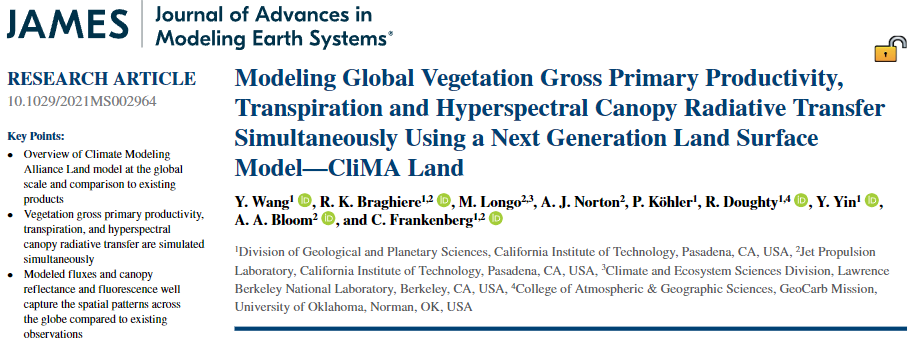
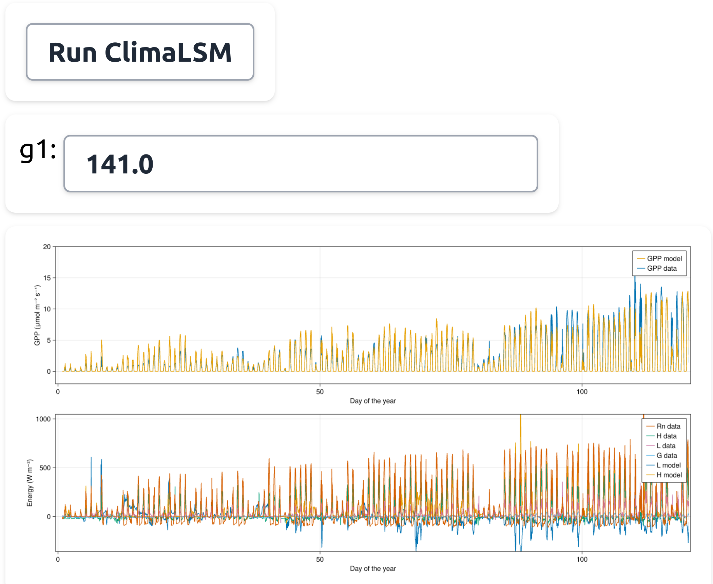

# An introduction to ClimaLSM.jl

Alexandre A. Renchon, Katherine Deck, Renato Braghiere, Julia Sloan, Edward Speer

  
    Press Space for next page <carbon:arrow-right class="inline"/>
  

  <button @click="$slidev.nav.openInEditor()" title="Open in Editor" class="text-xl slidev-icon-btn opacity-50 !border-none !hover:text-white">
    <carbon:edit />
  </button>
  <a href="https://github.com/slidevjs/slidev" target="_blank" alt="GitHub"
    class="text-xl slidev-icon-btn opacity-50 !border-none !hover:text-white">
    <carbon-logo-github />
  </a>

<!--
I will present CliMA land surface model and go in more details for our SOC implementation
-->

---

# Background #1: CliMA ESM

- [clima.caltech.edu](https://clima.caltech.edu)
- [github.com/CliMA](https://github.com/CliMA)
 
 

- Data assimilation & AI "A step change in the accuracy and usability of climate predictions"
- Scalable and modular
- Ecosystem of front-end apps

---

# Background #2: CliMA LSM 

- CliMA/land

 

- **CliMA/ClimaLSM.jl**
	- Coupled to atmosphere
	- Early development

---

# Background #3: An ESM 100% written in Julia

- Modern, fast, dynamic, open-source, reproducible, composable
- Great for GPU and AI
- No call between programming languages
 
 
- [julialang.org](https://julialang.org/)

---

# ClimaLSM.jl design #1: standalone and integrated  

- Each submodel can be run independently (e.g., soil CO2)
- Example below: constant rain, free drainage 
	- submodels: 
		- energy (latent & sensible heat) 
		- hydrology (prognostic moisture) 
		- biogeochemistry (prognostic co2: production & diffusion)

<video width="320" height="240" controls>
  <source src="images/time_animation2.mp4" type="video/mp4">
</video>

---
layout: iframe-right
url: https://clima.github.io/ClimaLSM.jl/previews/PR214/dynamicdocs/pages/soil_biogeochemistry/microbial_respiration/
scale: 0.4 
---

# ClimaLSM.jl design #2: clear documentation 

- 100s of web apps to facilitate communication 
- Equations for parameterisation and prognostic variables
- Table of variable with name, symbol, units and typical range
 
 
- Delta SOC = input (litterfall, root exudates) - output (heterotrophic respiration, export)
- Prognostic: Water, SOC, CO2, O2
- Discretised soil layers but only one SOM pool 

---

# ClimaLSM.jl design #3: modularity

- Julia multiple dispatch allow to easily swap between submodels
- E.g., soil biogeochemistry:
	- Dual Arrhenius Michaelis Menten
	- CENTURY
	- Heterogeneous kinetics

---

# ClimaLSM.jl design #4: accessibility

- Web app to run single site, producing visualisation & output file
- Example below: prototype with ozark data, and g1 parameter
- Future widgets: domain, timestepper, parameters

---
layout: iframe-right
url: https://cupoftea.earth/menu2/
scale: 0.4 
---

# ClimaLSM.jl design #5: ModEx: emergent pattern at scales

- E.g., at ecosystem scale, ecosystem respiration optimal moisture
- Do LSM capture this? (where, when, PFT, ...)
- Multiple other example: Topt of ER, GPP, Gs vs. SWC, VPD, ...
- Stay up-to-date with data and model dev, versioning

---

# ClimaLSM.jl next steps

- Test our parameterisation scheme
	- can we perform better than other LSM at Flux sites, despite simpler model?
- Global run (currently, only single site)
- Couple ClimaLSM.jl to the atmosphere
 
 
- Manuscript ClimaLSM.jl vs FLUXNET, structure, design, modularity, parameterisation, docs, tutorials, web apps, emergent pattern
